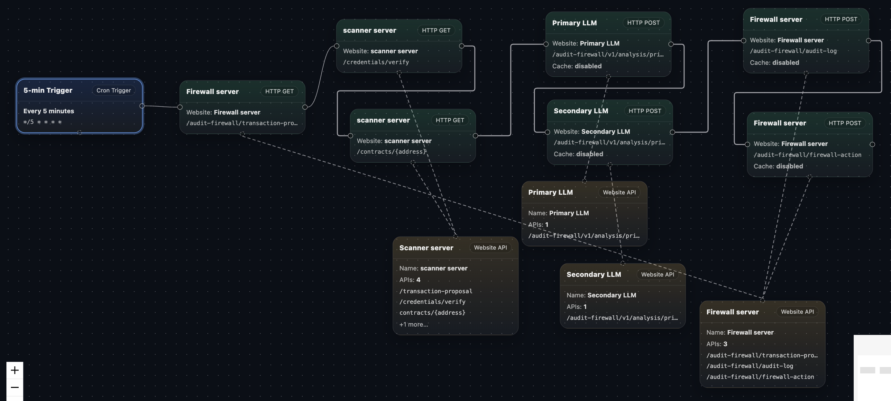

# Case Study 1: AI Audit Firewall Overview

> Template source: [`cre-templates/starter-templates/confidential-workflows/ai-audit-firewall`](https://github.com/smartcontractkit/cre-templates/tree/main/starter-templates/confidential-workflows/ai-audit-firewall)

The template is available in TypeScript and Go; the two implementations are behaviorally equivalent. In this bootcamp we are using TypeScript.

## The Use Case: A Confidential Pre-Execution Security Firewall

Imagine you're building a trading product: before a user executes an onchain interaction (say, with an unfamiliar token contract or protocol router), they want an automated line of defense that:

1. Takes the context of the **proposed transaction** (target token contract, protocol contract, calldata, etc.)
2. Fetches both contracts' source code, ABI, and verification status through a **chain scanner**
3. Runs an **AI-powered security audit** on the contracts, producing structured risk signals
4. Issues a **firewall verdict** based on aggregate risk: allow, block, or route for manual review
5. Persists an audit log, and optionally **writes the verdict onchain** for contracts to consume

That's the **AI Audit Firewall**: a pre-execution security audit workflow driven by two LLMs running inside a confidential execution environment.

## Why This Use Case Needs a Confidential Workflow

This workflow handles things that must not leak at every step:

| Confidential asset | Impact of leakage |
|--------------------|-------------------|
| 🔑 Scanner API credentials | Third parties could abuse your paid scanner quota or spoof scan results |
| 🔑 Both LLM API credentials | Keys with spending limits get stolen — direct financial loss |
| 📄 Fetched contract source code and audit intermediates | The audit process gets observed; attackers can craft contracts that specifically evade detection |
| 🧠 Audit prompts and evaluation process | Once the audit criteria leak, malicious contracts can be engineered to "pass the test" |

With `handlerInTee`, all of the above stays inside the enclave: credentials are released by the Vault DON directly into the enclave, and the URLs, headers (including API keys), and response bodies of HTTP calls remain confidential from node operators.

## Workflow Flow

```
                    ┌────────────────────────────────────────────────┐
                    │                CRON Trigger fires              │
                    │    (screens a pending transaction every 5 min) │
                    └────────────────────────┬───────────────────────┘
                                             │
                                             ▼
┌──────────────────────────────────────────────────────────────────────────┐
│ Stage 1: Ingest the proposed transaction (collectTransactionProposal)    │
│ GET /transaction-proposal → token + protocol contract addresses,         │
│ calldata, signer, ...                                                    │
└────────────────────────────────────────┬─────────────────────────────────┘
                                         │
                                         ▼
┌──────────────────────────────────────────────────────────────────────────┐
│ Stage 2: Fetch & validate contract data, confidentially                  │
│ ① GET /credentials/verify  → validate scanner credential scopes          │
│ ② GET /contracts/{address} → source, ABI, compiler version, and          │
│                              verification status for both contracts      │
│ ③ Any contract not verified by the scanner → immediate DENY, log & exit  │
└────────────────────────────────────────┬─────────────────────────────────┘
                                         │
                                         ▼
┌──────────────────────────────────────────────────────────────────────────┐
│ Stage 3: Dual-LLM confidential audit                                     │
│ Primary model:   audits the token contract + transaction proposal        │
│ Secondary model: audits the protocol contract, given Primary's findings  │
│ Each returns structured risk signals:                                    │
│   · obfuscatedTax (hidden tax)      · privilegeEscalation                │
│   · externalCallRisk                · logicBomb                          │
│   · recommendation (allow/deny/review) + confidence + reasoning          │
└────────────────────────────────────────┬─────────────────────────────────┘
                                         │
                                         ▼
┌──────────────────────────────────────────────────────────────────────────┐
│ Stage 4: Enforce the verdict & keep records                              │
│ ① determineVerdict: merge both models' signals                           │
│    → ALLOW / DENY / MANUAL_REVIEW                                        │
│ ② POST /audit-log       → persist the full audit record                  │
│ ③ POST /firewall-action → enforce (allow / block / manual review)        │
│ ④ (optional) signed report written onchain via EVM Write                 │
└──────────────────────────────────────────────────────────────────────────┘
```

### Visualize the Workflow



Want to explore this workflow yourself? The complete workflow definition is available as a [JSON file](../assets/CRE-AI_Audit_Firewall.json). You can import it into [https://cre.solange.dev/](https://cre.solange.dev/) — a visual GUI tool for CRE workflows — to inspect and interact with the flow step by step.

## The Verdict Rules (Conservative Merge)

`determineVerdict` follows a "better safe than sorry" strategy:

1. Either model flags **any risk signal** → **DENY**
2. Otherwise, if either model recommends review, has confidence below 0.7, or the two models disagree → **MANUAL_REVIEW**
3. Otherwise → **ALLOW**

## Project Structure

```
ai-audit-firewall/                  ← CRE project root
├── project.yaml                    ← Project-level config (RPC endpoints)
├── secrets.yaml                    ← Secret ID → env var mappings
├── .env.example                    ← Environment variable template
├── contracts/                      ← Optional onchain consumer contract
│   ├── AuditFirewallConsumer.sol
│   └── ReceiverTemplate.sol
└── ai-audit-firewall-ts/           ← TypeScript workflow
    ├── main.ts                     ← The workflow code ⭐
    ├── workflow.yaml               ← Workflow settings
    ├── config.staging.json         ← Simulation config (URLs, secret IDs)
    └── mock-server.js              ← Local deterministic mock API server
```

### The Three Secrets

`secrets.yaml` declares every secret the workflow uses — all fetched inside the enclave:

| Secret ID | Purpose |
|-----------|---------|
| `scanner_api_key` | Access the contract scanner (fetch source/ABI, verify credentials) |
| `primary_llm_api_key` | Call the first audit model |
| `secondary_llm_api_key` | Call the second audit model |

## The Mock Server: No Real APIs Needed

To make the demo fully self-contained, the template ships an Express-based **mock server** (`mock-server.js`) that simulates the three kinds of external dependencies locally, exposing only `/audit-firewall/*` routes:

| Mock endpoint | Simulated role |
|---------------|----------------|
| `GET /audit-firewall/transaction-proposal` | Source of transaction proposals |
| `GET /audit-firewall/scanner/contracts/:address` | Contract scanner (like an Etherscan-style service) |
| `GET /audit-firewall/scanner/credentials/verify` | Scanner credential validation |
| `POST /audit-firewall/v1/analysis/primary` | The first LLM audit model |
| `POST /audit-firewall/v1/analysis/secondary` | The second LLM audit model |
| `POST /audit-firewall/audit-log` | Audit logging service |
| `POST /audit-firewall/firewall-action` | Firewall action enforcement |

The mock data is **deterministic**: it ships with a well-behaved `MockERC20Token` and a `MockProtocolRouter` carrying an "external calls" note, so we can anticipate the demo outcome. In a real deployment, swap these URLs for the real services — the workflow code doesn't change.

## What's Next

Now that we've seen the overall flow, let's dive into `main.ts` and see how a Chainlink Confidential Workflow is actually written.
