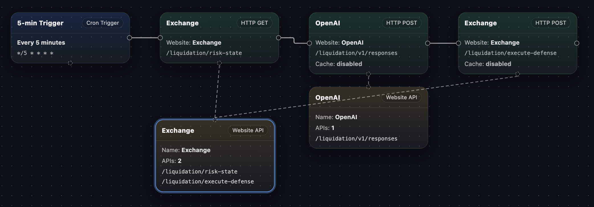

# Case Study 2: Automated Liquidation Protection Overview

> Template source: [`cre-templates/starter-templates/confidential-workflows/automated-liquidation-protection`](https://github.com/smartcontractkit/cre-templates/tree/main/starter-templates/confidential-workflows/automated-liquidation-protection) (available in TypeScript and Go; the two implementations are behaviorally equivalent)

## The Use Case: Confidential Automated Defense Before Liquidation

This workflow provides **continuous risk monitoring and automated defense** for a DeFi lending position:

1. Periodically fetches the position's **risk snapshot**: collateral/debt prices, health factor, liquidation proximity, LTV, market volatility, plus your available capital (stablecoin reserves, cash balance)
2. Inside a confidential environment, computes a risk score using your **private policy parameters**, and asks an LLM policy engine for a defense decision
3. Validates the decision against **hard policy constraints** (deployment caps, reserve floors, ...)
4. **Executes defensive actions** in your preferred order: add collateral, repay debt, or a combination of both

Everything happens **before** liquidation arrives — automatically pulling the health factor back into the safe zone during high volatility.

## Why This Use Case Must Run Confidentially

This is the signature use case in the Confidential Workflows documentation, and it protects even more than Case Study 1:

| Confidential asset | Impact of leakage |
|--------------------|-------------------|
| 🔑 Exchange API credentials | Credentials that can query your account balances and reserves get stolen |
| 🔑 LLM API credentials | Keys with spending limits get stolen |
| 🎯 **Risk thresholds** (warning line, min/target health factor) | Predicted → front-run, deliberately pushed toward the liquidation line |
| 💰 **Capital parameters** (reserve deployment cap, minimum reserve balance, collateral allocation cap) | Adversaries calculate the exact boundary of your defensive capacity |
| 🔀 **Execution preferences** (collateral-first vs. debt-first, preferred venues) | Your defensive moves get traded against in advance |

> Notice an interesting design choice: **the policy parameters are themselves secrets**. This workflow has 11 secrets, 9 of which are not "credentials" in the traditional sense but thresholds and strategy — all released by the Vault DON into the enclave. Node operators have no way to learn "when you act, or how much you can deploy."

## Workflow Flow

```
                    ┌──────────────────────────────────────────────┐
                    │              CRON Trigger fires              │
                    │      (evaluates the position every 5 min)    │
                    └──────────────────────┬───────────────────────┘
                                           │
                                           ▼
┌────────────────────────────────────────────────────────────────────────┐
│ Stage 0: Fetch 11 secrets inside the enclave                           │
│ Exchange credential + LLM credential + 9 policy parameters             │
│ (thresholds / caps / preferences)                                      │
└──────────────────────────────────────┬─────────────────────────────────┘
                                       │
                                       ▼
┌────────────────────────────────────────────────────────────────────────┐
│ Stage 1: Observe risk signals (collectRiskSnapshot)                    │
│ GET /risk-state → collateral/debt prices, health factor, liquidation   │
│ proximity, LTV, liquidation threshold, volatility, USDC reserve, cash  │
└──────────────────────────────────────┬─────────────────────────────────┘
                                       │
                                       ▼
┌────────────────────────────────────────────────────────────────────────┐
│ Stage 2: Confidential policy reasoning                                 │
│ ① computeRiskScore: deterministic risk score                           │
│    = proximity risk + LTV buffer risk + health risk + volatility risk  │
│ ② Package risk + riskScore + policy into the prompt                    │
│ ③ POST /v1/responses → the LLM policy engine returns a decision:       │
│    shouldDefend + reasoning + actions[]                                │
└──────────────────────────────────────┬─────────────────────────────────┘
                                       │
                                       ▼
┌────────────────────────────────────────────────────────────────────────┐
│ Stage 3: Hard policy checks (enforcePolicy)                            │
│ · per-execution spend ≤ max_reserve_deployment                         │
│ · post-action reserve ≥ min_reserve_balance (breach → throw)           │
│ · partial repayment % ≤ max_partial_debt_repayment_pct                 │
│ · order actions per execution_sequence_preference                      │
└──────────────────────────────────────┬─────────────────────────────────┘
                                       │
                                       ▼
┌────────────────────────────────────────────────────────────────────────┐
│ Stage 4: Execute the defense plan                                      │
│ · proximity ≤ warning threshold and actions exist                      │
│   → POST /execute-defense → "DEFENDED"                                 │
│ · otherwise → log the reason and return "SAFE"                         │
└────────────────────────────────────────────────────────────────────────┘
```

### Visualize the Workflow



Want to explore this workflow yourself? The complete workflow definition is available as a [JSON file](../assets/CRE-Automated_Liquidation_Protection.json). You can import it into [https://cre.solange.dev/](https://cre.solange.dev/) — a visual GUI tool for CRE workflows — to inspect and interact with the flow step by step.

## The Seven Defensive Actions

Recapping the two broad approaches from the previous section, the workflow's full action set:

| Type | Action | Category |
|------|--------|----------|
| `add_collateral` | Add collateral directly with reserves | Collateral side |
| `bridge_and_add_collateral` | Bridge assets cross-chain, then add | Collateral side |
| `swap_reserve_to_collateral` | Swap reserves into the collateral asset, then deposit | Collateral side |
| `repay_with_reserves` | Repay debt directly with reserves | Debt side |
| `swap_reserve_to_borrowed_and_repay` | Swap reserves into the borrowed asset, then repay | Debt side |
| `partial_debt_repayment` | Repay a percentage of the debt | Debt side |
| `full_debt_repayment` | Repay the debt in full | Debt side |

## Project Structure

```
automated-liquidation-protection/         ← CRE project root
├── project.yaml                          ← Project-level config (RPC endpoints)
├── secrets.yaml                          ← 11 secret ID → env var mappings
├── .env.example                          ← Env var template (with all policy defaults)
└── automated-liquidation-protection-ts/  ← TypeScript workflow
    ├── main.ts                           ← The workflow code ⭐
    ├── workflow.yaml                     ← Workflow settings
    ├── config.staging.json               ← Simulation config (URLs, secret ID mappings)
    └── mock-server.js                    ← Local deterministic mock API server
```

### The Eleven Secrets

| Secret ID | Type | Purpose |
|-----------|------|---------|
| `exchange_api_key` | Credential | Access account data (risk snapshot, execute defense) |
| `openai_api_key` | Credential | Call the LLM policy engine |
| `liquidation_liquidation_warning_action_threshold` | Policy | Liquidation proximity warning line (default 18%) |
| `liquidation_minimum_health_factor` | Policy | Minimum health factor (default 1.25) |
| `liquidation_target_health_factor` | Policy | Target health factor (default 1.5) |
| `liquidation_maximum_stablecoin_reserve_deployment` | Policy | Max reserve deployment per execution, $ (default 5000) |
| `liquidation_minimum_stablecoin_reserve_balance` | Policy | Minimum reserve balance, $ (default 2000) |
| `liquidation_maximum_collateral_allocation` | Policy | Collateral allocation cap, % (default 80) |
| `liquidation_maximum_partial_debt_repayment` | Policy | Partial repayment cap, % (default 40) |
| `liquidation_defensive_action_sequencing_preference` | Policy | Sequencing preference (default collateral-first) |
| `liquidation_preferred_venues` | Policy | Preferred venue list (default binance,onchain,coinbase) |

## The Mock Server

Same pattern as Case Study 1: an Express mock server simulates the external dependencies locally, exposing only `/liquidation/*` routes:

| Mock endpoint | Simulated role |
|---------------|----------------|
| `GET /liquidation/risk-state` | Exchange/account data source (risk snapshot) |
| `POST /liquidation/v1/responses` | OpenAI-style LLM policy engine |
| `POST /liquidation/execute-defense` | Defense action execution endpoint |

The built-in default risk snapshot is a position **already in the danger zone**:

```
Collateral: ETH $45,000   Debt: $32,000 USDC
Health factor: 1.14       Liquidation proximity: 12% (warning line: 18%)
LTV: 71% / threshold 78%  Volatility: 0.37
USDC reserve: $10,000     Cash: $12,500
```

→ Liquidation proximity of 12% has already breached the 18% warning line, so the workflow should **spring into action**.

## What's Next

Let's open `main.ts` and see how all the policy parameters are injected as secrets, and how deterministic constraints "backstop" the LLM's decisions.
