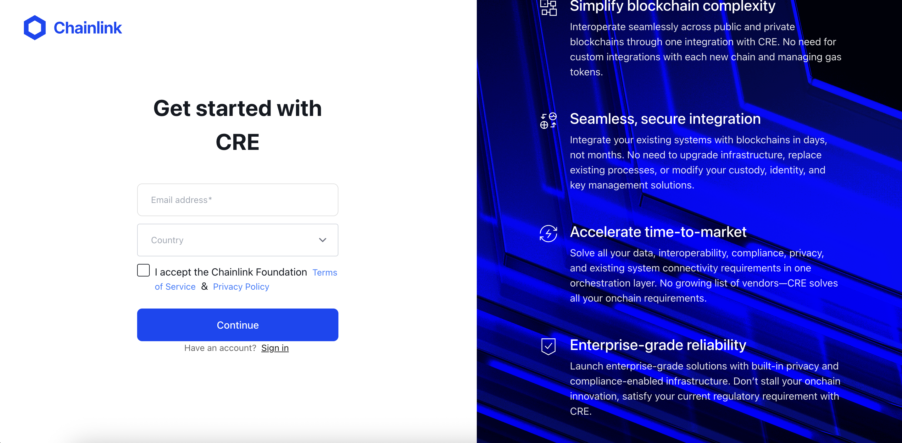
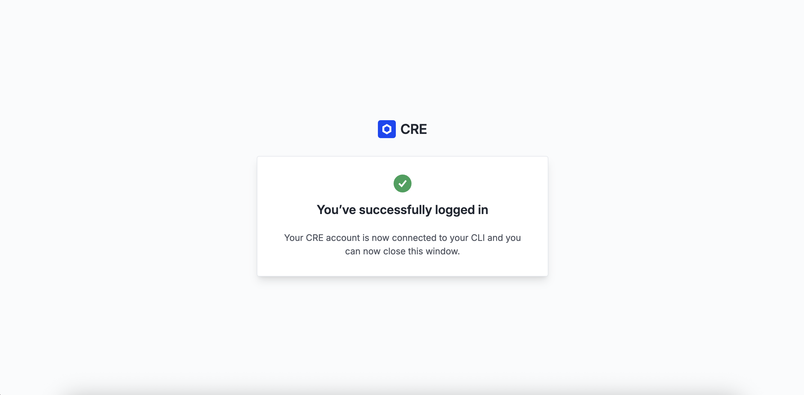

# CRE CLI Quick Setup

Before we start building, let's make sure your CRE environment is set up correctly. We'll follow the official guide at [cre.chain.link](https://cre.chain.link).

## Step 1: Create a CRE Account

1. Visit [cre.chain.link](https://cre.chain.link)
2. Create an account or log in
3. Access the CRE platform dashboard



## Step 2: Install the CRE CLI

The **CRE CLI** is essential for compiling and simulating workflows. It compiles your TypeScript code into a WebAssembly (WASM) binary and lets you test workflows locally before deployment.

### Option 1: Automatic Installation

The easiest way to install is using the installation script ([reference docs](https://docs.chain.link/cre/getting-started/cli-installation)):

#### macOS/Linux

```bash
curl -sSL https://cre.chain.link/install.sh | sh
```

#### Windows

```powershell
irm https://cre.chain.link/install.ps1 | iex
```

### Option 2: Manual Installation

If you prefer manual installation, or if the automatic installation doesn't work for your environment, follow the official Chainlink documentation for your platform:

- [macOS/Linux](https://docs.chain.link/cre/getting-started/cli-installation/macos-linux#manual-installation)
- [Windows](https://docs.chain.link/cre/getting-started/cli-installation/windows#manual-installation)

### Verify Installation

```bash
cre version
```

## Step 3: Authenticate with the CRE CLI

Link your CLI to your CRE account:

```bash
cre login
```

This opens a browser window for authentication. Once authenticated, your CLI is ready to use.



Check your login status and account info:

```bash
cre whoami
```

## Troubleshooting

### CRE CLI command not found

If the `cre` command is not found after installation:

#### macOS/Linux

```bash
# Add to your shell config file (~/.bashrc, ~/.zshrc, etc.)
export PATH="$HOME/.cre/bin:$PATH"

# Reload your shell
source ~/.zshrc  # or ~/.bashrc
```

#### Windows

[Add the CLI to your PATH](https://docs.chain.link/cre/getting-started/cli-installation/windows#3-add-the-cli-to-your-path)

## What Can You Do Now?

With CRE set up, you can:

- **Create a new CRE project**: Run `cre init` to get started
- **Compile workflows**: The CRE CLI compiles your TypeScript code into a WASM binary
- **Simulate workflows**: Test workflows locally with `cre workflow simulate` — both case studies in this bootcamp run this way
- **Deploy workflows**: Deploy to production when ready (Early Access)

> **Note**: Deploying Confidential Workflows is currently in Private Beta and requires separate enrollment (see the [Day 2 wrap-up](../day-2/05-wrap-up.md)). However, **local simulation requires no special access** — which is exactly how we run everything in this bootcamp.
