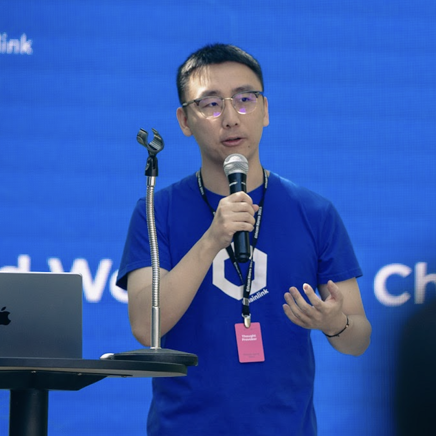

# Welcome to the CRE Confidential Bootcamp

Welcome to the **CRE Confidential Bootcamp: Build Confidential Workflows**!

This is a two-day, hands-on bootcamp designed to give you a deep, developer-focused guide to building confidential computing workflows with the Chainlink Runtime Environment (CRE).

## 🎤 Instructor

### Frank Kong
**Developer Relations Engineer, Chainlink Labs**

X (Twitter): [@frank_chainlink](https://x.com/frank_chainlink)

LinkedIn: [Frank Kong](https://www.linkedin.com/in/frank-kong-0a927785/)

X (Twitter): [@solangegueiros](https://twitter.com/solangegueiros)

LinkedIn: [Solange Gueiros](https://www.linkedin.com/in/solangegueiros/)

X (Twitter): [@darbease](https://x.com/darbease)

LinkedIn: [Darby Martinez](https://www.linkedin.com/in/darby-martinez/)

## Schedule

### 📅 Day 1: CRE + Confidential Workflow Fundamentals (1.5 hours)

Build a core understanding of CRE and confidential computing, and run your first Confidential Workflow:

- CRE core concepts and mental model
- Confidential Workflows: TEEs, enclaves, and the Vault DON
- Case Study 1: AI Audit Firewall (smart contract audit firewall)
  - Workflow flow and key code walkthrough
  - How Chainlink implements Confidential Workflows
  - Why this use case must run confidentially
- Case Study 1 demo
- ❓ Q&A - open questions

### 📅 Day 2: Hands-On — Automated Liquidation Protection (1.5 hours)

No repeated fundamentals — we jump straight into the second complete case study:

- Finance primer: what liquidation is and how to prevent it
- Case Study 2: Automated Liquidation Protection
  - Workflow flow and key code walkthrough
  - Confidential policy parameters and front-running resistance
- Case Study 2 demo
- Wrap-up and next steps
- ❓ Q&A - open questions

## What You'll Build

Two complete applications built on **CRE Confidential Workflows** (each available in both TypeScript and Go):

| Case Study | One-liner | What confidentiality protects |
|-----------|-----------|-------------------------------|
| **AI Audit Firewall** | Before a transaction executes, two LLMs audit the target contracts inside an enclave and produce an ALLOW / DENY / MANUAL_REVIEW verdict, optionally written onchain | Scanner and LLM API credentials, plus the audit process data |
| **Automated Liquidation Protection** | Continuously monitors a lending position's health and automatically adds collateral or repays debt before liquidation happens | Exchange credentials, risk thresholds, and defense strategy parameters |

Both case studies come from the official CRE templates repo: [cre-templates](https://github.com/smartcontractkit/cre-templates/tree/main/starter-templates/confidential-workflows).
